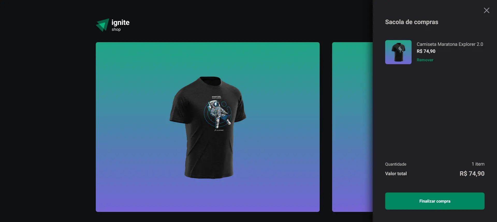
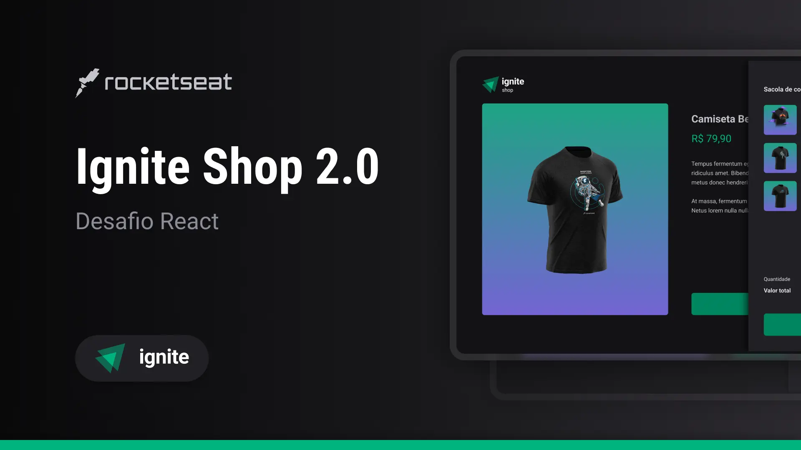

<!-- ===== HEADER ===== -->
<p align="right">
  <a href="./README.md" title="Read the README in english">
    
  </a>
  
</p>

<h1 align="center">
  <a
    href="https://guipmdev-ignite-shop-v2.vercel.app/"
    title="Acessar a aplicação web"
  >
    
  </a>
</h1>

<p align="center">
  
  
  
  <a
    href="https://github.com/guipmdev/ignite-shop-v2/commits/main"
    title="Visualizar commits do repositório"
  >
    
  </a>
  <a href="./LICENSE" title="Visualizar licença do projeto">
    
  </a>
  <a href="https://www.rocketseat.com.br/" title="Acessar o site da Rocketseat">
    
  </a>
</p>



<p align="center">
  <a href="https://guipmdev-ignite-shop-v2.vercel.app/"
    >Acessar a aplicação web ↗</a
  >
</p>

<details>
  <summary>
    <h2>📒 Índice</h2>
  </summary>

- [📍 Visão geral](#-visão-geral)
- [✨ Funcionalidades](#-funcionalidades)
- [🤖 Demo](#-demo)
- [🎨 Layout](#-layout)
- [🛠 Tecnologias](#-tecnologias)
  - [Website](#website)
  - [Úteis](#úteis)
- [🚀 Primeiros passos](#-primeiros-passos)
  - [✔️ Pré-requisitos](#️-pré-requisitos)
  - [📦 Instalação](#-instalação)
  - [⚙️ Utilização](#️-utilização)
- [📄 Licença](#-licença)
- [👏 Reconhecimentos](#-reconhecimentos)
</details>

<!-- ===== PROJECT INFOS ===== -->

## 📍 Visão geral

Este projeto é uma aplicação web desenvolvida em _Next.js_ e _TypeScript_ de uma loja on-line fictícia que exibe seus produtos na página inicial em formato de carrossel, possibilitando aos usuários visualizarem os detalhes clicando neles e fazer o pagamento pela Stripe. Ela também tem um carrinho de compras e uma página de sucesso que exibe os detalhes dos itens comprados.

O objetivo do Ignite Shop V2 é proporcionar uma experiência de compra ainda mais amigável e visualmente atraente, agora com uma sacola para guardar múltiplos itens, integrando-se a um processador de pagamento popular para simplificar o processo de compra aos clientes.

## ✨ Funcionalidades

👕 **Veja todas as peças de roupa** disponíveis de forma fácil

👀 **Veja mais detalhes** clicando no produto desejado

🛒 Adicione os itens que desejar ao **carrinho**

🔄 Seu **carrinho fica salvo** até você fechar o pedido, então pode atualizar a página sem medo

💳**Faça o pagamento** pela Stripe (_apenas simbólico_)

🚚 Aguardar as compras chegarem

## 🤖 Demo

https://github.com/guipmdev/ignite-shop-v2/assets/136738335/fd45f116-53eb-426f-b6e9-aa328dadaa6f

## 🎨 Layout

O layout da aplicação foi projetado pela **Rocketseat** e está disponível no [Figma](https://www.figma.com/file/nIkPaTxXF0NedsKjOaSdMq/Ignite-Shop-2.0-%E2%80%A2-Desafio-React).

<p align="center">
  
</p>

## 🛠 Tecnologias

As seguintes ferramentas foram usadas para desenvolver esse projeto:

### Website

<p>
  <a href="https://nextjs.org/">
    
  </a>
  <a href="https://www.typescriptlang.org/">
    
  </a>
  <a href="https://eslint.org/">
    
  </a>
  <a href="https://github.com/rocketseat/eslint-config-rocketseat">
    
  </a>
</p>

<p>
  <a href="https://axios-http.com/">
    
  </a>
  <a href="https://stripe.com/">
    
  </a>
  <a href="https://useshoppingcart.com/">
    
  </a>
  <a href="https://sharp.pixelplumbing.com/">
    
  </a>
</p>

<p>
  <a href="https://stitches.dev/">
    
  </a>
  <a href="https://phosphoricons.com/">
    
  </a>
  <a href="https://www.radix-ui.com/">
    
  </a>
  <a href="https://keen-slider.io/">
    
  </a>
</p>

_\* Confira o arquivo [<kbd>package.json</kbd>](./package.json)_

### Úteis

<p>
  <a href="https://git-scm.com/">
    
  </a>
  <a href="https://nodejs.org/">
    
  </a>
  <a href="https://figma.com/">
    
  </a>
  <a href="https://fonts.google.com/">
    
  </a>
  <a href="https://code.visualstudio.com/">
    
  </a>
</p>

## 🚀 Primeiros passos

### ✔️ Pré-requisitos

Antes de você começar, certifique-se que você tem as seguintes ferramentas instaladas na sua máquina: [Git](https://git-scm.com/downloads), [Node.js](https://nodejs.org/en/download). Também é bom ter um editor para trabalhar com o código, como o [VSCode](https://code.visualstudio.com/Download).

### 📦 Instalação

1. Clone o repositório:

```sh
git clone https://github.com/guipmdev/ignite-shop-v2/
```

2. Mude para o diretório do projeto:

```sh
cd ignite-shop-v2
```

3. Instale as dependências:

```sh
npm install
```

### ⚙️ Utilização

1. Acesse/crie a sua conta na [Stripe](https://stripe.com/)

   - Crie uma loja, produtos e faça toda a configuração necessária

2. Obtenha as suas [_API keys_](https://dashboard.stripe.com/test/apikeys)

3. Renomeie o arquivo `.env.local.example` para `.env.local` e insira as informações necessárias:

```sh
mv .env.local.example .env.local
```

4. Inicie a aplicação web:

```sh
npm run dev
```

5. Acesse http://localhost:3000/ para visualizar a aplicação

## 📄 Licença

Este projeto está licenciado de acordo com os termos da licença `MIT`. Consulte o arquivo [LICENSE](./LICENSE) para mais informações.

## 👏 Reconhecimentos

> - Muito obrigado à [Rocketseat](https://www.rocketseat.com.br/) pelo layout e pelas dicas de como montar este projeto

<!-- ===== FOOTER ===== -->

---

<p align="center">
  Feito com 💙 por
  <a href="https://www.guipm.dev/"> @guipm.dev </a>
  - Fique à vontade para
  <a href="mailto:guipm.dev@gmail.com">entrar em contato comigo</a>!
</p>

<br />

<p align="center">
  <a href="#top">
    <b>↑&nbsp;&nbsp; Voltar ao topo &nbsp;&nbsp;↑</b>
  </a>
</p>
